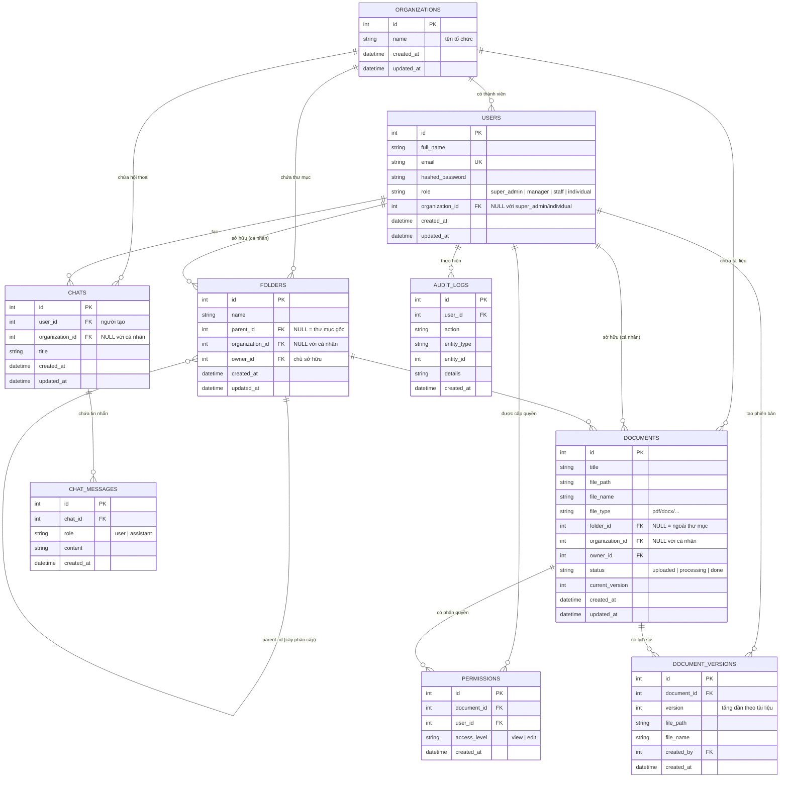

# ERD — AI Document Manager

> Sơ đồ quan hệ thực thể (ERD) của toàn bộ schema. DB quản lý bằng Alembic (`backend/alembic/versions/`).

## Ghi chú thiết kế

- **Phạm vi dữ liệu theo vai trò**: bảng `folders`, `documents`, `chats` có `organization_id` (nullable).
  - `organization_id` khác NULL → dữ liệu dùng chung trong tổ chức (manager/staff).
  - `organization_id` NULL → dữ liệu riêng của `owner_id` (cá nhân).
- **`users.role`**: `super_admin` không thuộc tổ chức; `manager`/`staff` thuộc tổ chức; `individual` không thuộc tổ chức.
- **Quan hệ `folders.parent_id`** tự tham chiếu tạo cây thư mục phân cấp.
- **Ràng buộc duy nhất**: `users.email`, `(document_id, version)`, `(document_id, user_id)`.
- **`permissions`** (phân quyền chi tiết theo tài liệu) sẽ được dùng ở Giai đoạn 5.
